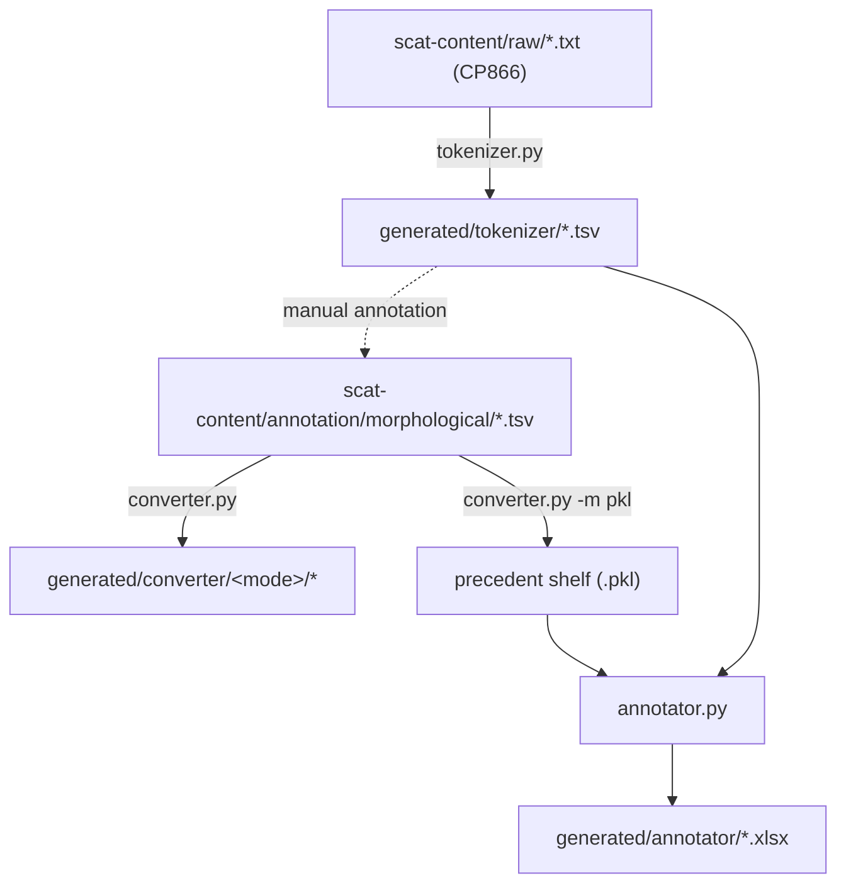

# Architecture

A map of the codebase for contributors. For installation and command-line usage, see the [README](../README.md); this document is about how the pieces fit together.

## Overview

### Pipeline

The toolkit is three independent command-line programs coupled only through files on disk — there is no shared runtime or orchestration layer. A manuscript moves through them like this:



- **`tokenizer.py`** segments a raw manuscript into a one-token-per-line TSV skeleton. Humans (historically, students on the annotation practicum) then fill in the morphological columns to produce the annotation TSVs held in `scat-content`.
- **`converter.py`** is the main pipeline: it reads an annotation TSV and, per token, normalises the orthography, computes the lemma, and serialises to one of several formats.
- **`annotator.py`** bootstraps *new* annotation: it takes a tokenised text plus a "precedent" shelf built by `converter.py -m pkl`, and emits an Excel workbook that pre-fills known analyses and offers ambiguous ones as dropdowns.

### Repository layout

```
src/
  tokenizer.py            CLI: raw text -> token skeleton
  converter.py            CLI: annotated TSV -> normalised, lemmatised output
  annotator.py            CLI: tokenised text + precedent shelf -> .xlsx
  models/                 domain objects
    row.py                Row / WordRow / XMLRow — the per-line unit
    word.py               Word — surface form, tagset, norm, lemma
    tagset/               morphological tag parsing (POS-dispatched)
    manuscript.py         Manuscript dataclass + id counters (loaded from YAML)
    punctuation.py milestone.py number.py
  components/             processing stages
    unicode_converter.py  transliteration -> Church Slavonic Unicode
    normalizer/           orthographic normalisation
    lemmatizer/           POS-dispatched lemmatisation
    writer/               output-format writers (factory)
    xml_processor.py      post-processing of generated TEI
    pickler.py            tagset serialisation for the precedent shelf
  data/manuscripts.py     loads resources/manuscripts.yaml
  utils/                  homoglyph tables, character classes, helpers
resources/
  manuscripts.yaml        manuscript metadata (!Manuscript objects)
  tagset_clusters.json    syncretic-tagset clusters (used by the annotator)
test/                     pytest suite
scat-content/             corpus content (git submodule)
```

## Domain model

### Rows and words

A **`Row`** (`src/models/row.py`) is the unit of a single annotation line. It always carries the raw 7 `columns`, and optionally a `Word`, head/tail `Punctuation`, and a trailing `Milestone`. The 7-column contract is asserted in `Row.__init__`.

- **`WordRow`** parses a real token: it strips leading punctuation, a trailing structural milestone, and trailing punctuation off the source, then builds a `Word` from what remains plus `columns[1:]`.
- **`XMLRow`** wraps a structural markup line (`<head>`, `<div1 …>`); its content passes through untouched.

A **`Word`** (`src/models/word.py`) holds the surface `source`, an optional scribal `error` correction, a `tagset`, and the computed `norm` and `lemma`. It exposes the Unicode-converted surface form (`__str__`, `orig`) and its TEI serialisation (`xml`). Two details worth knowing:

- The `lemma` setter (`Word.__setattr__`) title-cases proper nouns and lower-cases everything else, and maps the `+` transliteration character to `Ѣ`.
- `Word.id` reads `manuscripts[…].token_id`, which **mutates** a counter on every access (see [Resources](#resources)).

`Punctuation`, `Milestone`, and `Number` are small models for the non-word pieces; `milestone_factory` maps the break characters (`&` line, `\` column, `Z <n>` page) to `Milestone` subclasses.

### Tagsets

`tagset_factory` (`src/models/tagset/__init__.py`) dispatches on the part-of-speech tag in column 1:

| POS | Class |
| --- | --- |
| `сущ`, `прил`, `прил/ср`, `числ`, `числ/п` | `NounTagset` |
| `мест` with `личн` | `PronounTagset` |
| `мест` otherwise | `NounTagset` |
| `гл`, `гл/в` | `VerbTagset` |
| `прич`, `прич/в` | `ParticipleTagset` |
| anything else (incl. cardinal numbers, indeclinables) | bare `Tagset` |

There is deliberately **no adjective tagset** — adjectives, comparatives, ordinals and non-personal pronouns are all nominal in their inflection and share `NounTagset`.

Each subclass parses its positional grammemes and defines `__str__`, which produces the semicolon-joined tag string emitted as the TEI `@ana`/`msd` attribute. Conventions carried over from the annotation scheme (documented in the author's theses):

- **Declension** is coded by Proto-Slavic stem class (`o`, `jo`, `a`, `ja`, `i`, `u`, consonant stems `en`/`es`/…, and the hard pronominal/adjectival type `тв`). A slash records a mixed/shifting type (`es/o`).
- **Factual case:** a slash in the case column is "expected/actual"; the code keeps the actual value via `grammemes[i].split("/")[-1]`. The special case `вин/род` (accusative realised as genitive) is the diagnostic of **animacy**.
- **Participle voice** is *not* annotated; it is inferred from the declension type (`a`/`o`/`тв` → passive, else active).

Only the TEI writer consumes `Tagset.__str__`. It is written out and never parsed back, so the tag-string layout is not a load-bearing interface — but it *is* the corpus's published morphological signature, so changes to it change every affected token's export.

## Processing

### Normalisation

`Normalizer` (`src/components/normalizer/`) maps a manuscript form to a canonical Church Slavonic spelling. It is a port of E. G. Ufland's module, with the substitution rules held as regular-expression tables in `lib.py` and the algorithm in `normalizer.py`. It resolves titlo abbreviations and raised-letter spellings, undoes *TorT*-type liquid metathesis, and — because it runs *after* morphological tagging — uses the known part of speech to disambiguate context-dependent expansions.

### Lemmatisation

`lemmatizer_factory` (`src/components/lemmatizer/__init__.py`) picks a per-POS lemmatiser; the base `Lemmatizer` handles indeclinables by appending a jer (`Ъ`/`Ь`) to consonant-final forms. The nominal and verbal lemmatisers work by stripping the true inflection — `Lemmatizer.get_stem` matches a paradigm regex, keyed by the grammeme tuple, against the normalised form — and then reconstructing the citation form (nominative singular for nominals, the infinitive for verbs and participles). Auxiliary verbs in analytic tenses receive pseudo-lemmas rather than real ones, to keep frequency counts honest. Tokens whose lemma cannot be resolved are reported to the console by `converter.py` rather than failing the run.

### Writers and output formats

`writer_factory` (`src/components/writer/__init__.py`) maps a mode string to a writer. All writers subclass `Writer`, a context manager that opens its stream on entry and closes it on exit.

The important structural fact is that **each format renders morphology independently** — there is no single serialisation:

| Mode | Format | Morphology rendered by |
| --- | --- | --- |
| `tsv` | source columns + computed lemma | re-emits the raw input columns |
| `xml` | TEI P5 (TXM/XTZ profile) | `Tagset.__str__` (the `@ana`/`msd` attribute) |
| `txt` | plain Unicode running text | none (surface forms only) |
| `pkl` | `shelve` database, keyed by normalised form | `Pickler`'s own positional layout |

`tsv` and `xml` are the formats in practical use.

The `xml` writer post-processes its output through `XMLProcessor` on close (merging adjacent numerals and proper-name elements, pretty-printing).

## Resources

`resources/manuscripts.yaml` maps manuscript IDs to `!Manuscript` objects (`src/models/manuscript.py`), each holding a title and the starting page/column/line used to number the output. The class is a `yaml.YAMLObject`; importing it registers the `!Manuscript` tag, which is why `data/manuscripts.py` imports it for its side effect. Its `token_id` and `chunk_id` are auto-incrementing properties — reading one advances the counter — so writers rely on the order in which they touch a manuscript.

`resources/tagset_clusters.json` lists sets of morphologically syncretic tag vectors; the annotator uses it to expand one analysis into all of a form's possible readings.
